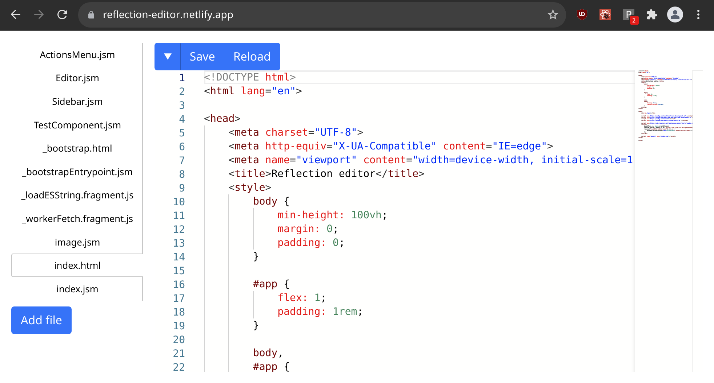

# reflection

### Self-hosting web code editor (originally for Hack Club CodeJelly)



Reflection editor is a code editor that edits its own code, and uses modern web technologies to run everything on your browser. A "file system" is stored in your browser's IndexedDB, and a service worker serves the pages as if it was an actual server. As much of the code as possible is editable directly from the editor, from the editor frontend (written with React and Monaco) to the service worker's network request handler. 

Try it out here: [https://reflection-editor.vercel.app](https://reflection-editor.vercel.app)

#### Help! I broke the editor

Unfortunately devtools won't let you edit the files directly in IndexedDB, but you can import `localforage` and use that to interact with them:

```js
// Import localforage
let script = `
import localforage from "https://cdn.skypack.dev/localforage";
globalThis.localforage = localforage;
`; let s = document.createElement("script"); s.type = "module"; s.innerText = script; document.body.appendChild(s);

// Get contents of file
await localforage.getItem("File.jsx");

// Set contents of file
await localforage.setItem("File.jsx", "// New contents");
```
